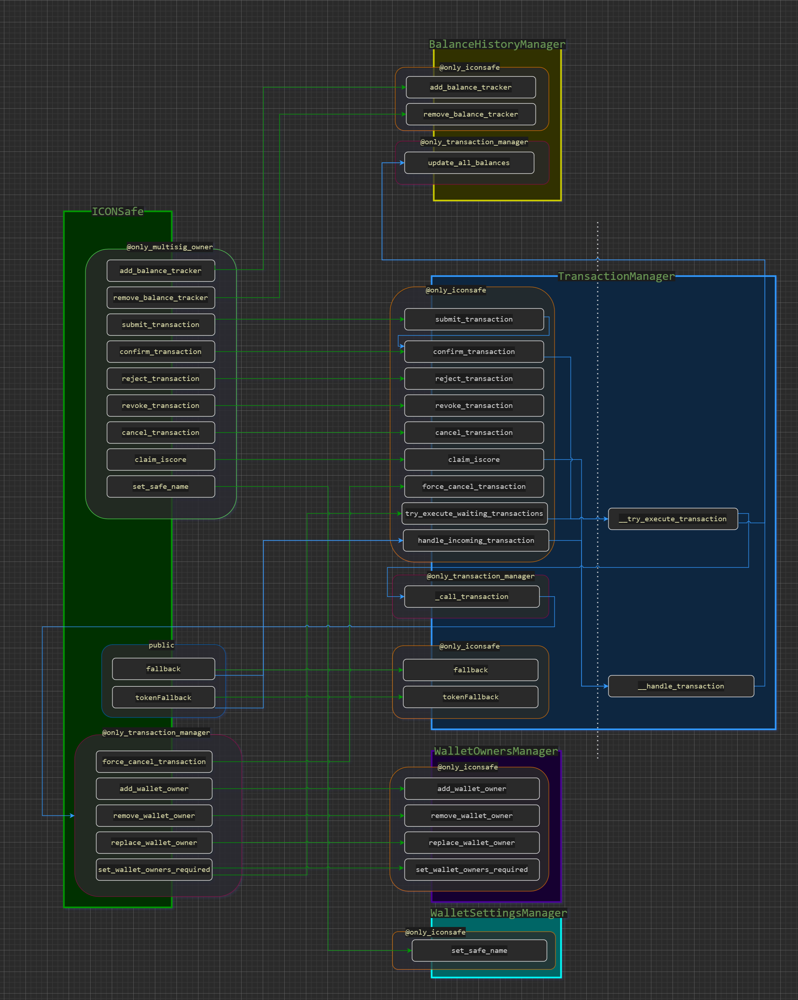

<p align="center">
  
</p>

 [](https://opensource.org/licenses/Apache-2.0)

## Introduction

ICONSafe is a multisig wallet with an advanced user management and built-in features for dApps running on ICON. It is mostly useful for teams willing to share mutual funds without having to risk sharing a same private key between members. 
ICONSafe is able to track tokens balance over time, and send/receive any type of transactions. All outgoing transactions require confirmations from the wallet owners based on a vote before being executed. An outgoing transaction may contain multiple sub-transactions which are executed at the same time, so it is possible to create complex operations suiting for all type of situations.

## Source Code

* GUI : https://github.com/iconsafe/iconsafe.github.io
* SCORE : https://github.com/iconation/ICONSafe-SCORE

## Architecture




## ICONSafe Installation (required before Deployment)

  * Install prerequisites:
    * `sudo apt install jq`
    * `python3 -m venv ./venv && source ./venv/bin/activate`
    * `pip install tbears`
  * Clone the ICONSafe repository:
    * `git clone https://github.com/iconation/ICONSafe-SCORE.git`
    * `cd ICONSafe-SCORE`
  * Go to the config folder and launch `install.sh` with the network you want to deploy the SCOREs to (for instance, mainnet)
    * `cd config`
    * `./install.sh mainnet`
  * It will generate wallets for the ICONSafe operator. Please send some funds to this address before deploying.
  * Go back to the root folder if you intend to deploy the contract
    * `cd ..`

## ICONSafe Deployment

  * Once installed, launch the deploy script from the root folder of the project with the network you want to deploy, for example mainnet:
    * `./scripts/score/deploy_all.sh -n mainnet`
  * You will need to input your operator wallet password for each contract deployed.
  * Please wait for your contracts to be **accepted after the Audit Process** before going to the next step.

## ICONSafe Post-deployment configuration

  * In order to communicate with eachothers, you will need to configure the AddressRegistrar contract:
    * `./scripts/score/register_all.sh -n mainnet`


## ICONSafe Localhost Development (T-Bears)

  * Bootstrap tbears using the `bootstrap_tbears.sh` script located in the tbears folder of the ICONSafe repository
    * `./tbears/bootstrap_tbears.sh`
  * Everytime you want to keep working on this contract after reboot, start tbears using the following script located in the tbears folder of the ICONSafe repository
    * `./tbears/start_tbears.sh`
  * Now t-bears is launched and you can work with t-bears as usual - see the scripts folder for pre-generated queries to ICONSafe.

## Upgrade ICONSafe contract

- If you modified the ICONSafe SCORE source code after deployment, you may need to update it.

- In the root folder of the project, run the following command:
<pre>$ ./scripts/score/update_score.sh</pre>

- It should display the following usage:
```
> Usage:
 `-> ./scripts/score/update_score.sh [options]

> Options:
 -n <network> : Network to use (localhost, yeouido, euljiro or mainnet)
 -p <package> : package to deploy
```

- Fill the `-n` option corresponding to the network where your SCORE is deployed to: `localhost`, `yeouido`, `euljiro` or `mainnet`.
- Fill the `-p` option corresponding to the package you want to update : `address_registrar`, `balance_history_manager`, `event_manager`, `iconsafe`, `transaction_manager`, `wallet_owners_manager`, `wallet_settings_manager`


- **Example** :
<pre>$ ./scripts/score/update_score.sh -n localhost -p iconsafe</pre>


- If you need to update all SCOREs, please use `update_all.sh`.